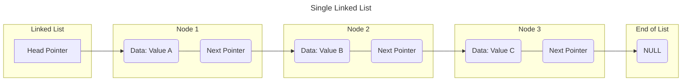
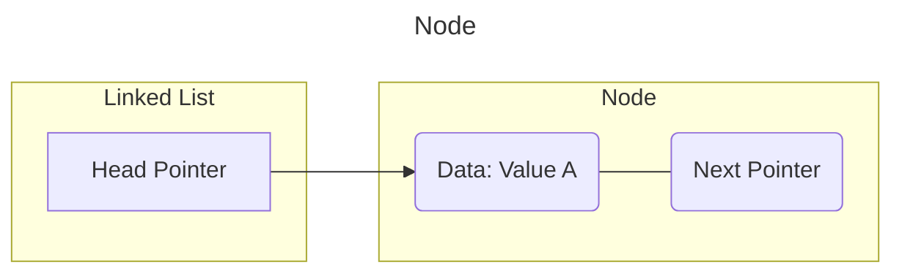

# Single Linked List



## Create a Node 

```c
struct SLL
{
    int rollno;
    char name[30];
    double marks;

    struct SLL *next;
    
};
```




In Single Linked List each node have two parts  
-
- Data part
- Address part

In Single Linked List a node can be inserted or deleted from any position
-  
- At Begin 
- At Middle  
- At End  

- Single Linked List traverse only forward direction  
- Reverse traverse not possible in Single Linked list

## Create a Head Pointer  
Head Pointer is required to keep the track of the allocated data in the main().

```c
SLL *headptr = 0;
```


## Add the record at begin  
1. Create a node using dynamic allocation.
2. Scan the information.
3. Update new record and its next.
4. Update Head Pointer.

### Calling From main()
```c
add_begin(&headptr);    /*Call by Reference*/
````
### Defination of add begin  
```c
/*Defination of add begin*/
void add_begin(SLL **ptr)
{
    SLL *new;
    new  = malloc(sizeof(SLL));

    printf("Enter rollno , name and marks\n");
    scanf("%d %s %f",&new->rollno, new->name, &new->marks);

    new->next = *ptr; /*Update the new record next*/

    *ptr = new; /*update the headptr*/
}
```


## Add the record at end
1. Create a node using dynamic allocation.
2. Scan the information.
3. Take a pointer `last` for navigation to last.
4. Update the new next (always 0).
5. If no records are there update head ptr, else update the last node.

### Calling From main()
```c
add_end(&headptr);    /*Call by reference*/
````
### Defination of add end  
```c
/*Defination of add end*/
void add_end(SLL *ptr)
{
    SLL *new, *last;

    new = malloc(sizeof(SLL)); /*Create a new node*/

    printf("Enter rollno name marks\n");
    scanf("%d %s %f", &new->roll, new->name, &new->marks);

    /*Always update the new->next will NULL*/
    new->next = 0;

    if(*ptr == 0)
    {
        /*Update the head pointer*/
        *ptr = new;    
    }
    else
    {
        last = *ptr; /*Start from first node*/

        /*Start traverse till last node*/
        while(last->next)
            last = last->next;    /*Visit next node*/

        last->next = new; /*Update last node next address as new*/
        
    }
}
```

## Add record at middle  
1. Create a node using dynamic memory.
2. Scan the information.
3. Create a pointer `*pos` for navigation.
4. Check if the headptr is empty or the records is to be added at first node.
5. update the `new->next = pos->next;`.
6. finally update `pos->next = new;`

### Calling from main()
```c
add_middle(&headptr);    /*Call by reference*/
```

### Defination of add middle

```c
void add_middle(SLL **ptr)
{
    SLL *new, *pos;

    new = malloc(sizeof(SLL));

    printf("Enter rollno, name and marks");
    scanf("%d %s %f", &new->rollno, new->name, &new->marks);

    /*Check For Empty Head pointer and If data to be entered at the first node itself*/
    if(*ptr == 0 || new->rollno < *ptr->rollno)
    {
        new->next = *ptr; /*update new next*/
        *ptr = new; /*update headptr*/
    }
    else
    {
        pos = *ptr;
        while((pos->next != 0) && (new->rollno > pos->next->rollno))
            pos = pos->next;

        new->next = pos->next;
        pos->next = new;
    }    
}
```

## Print the Nodes

### Calling of Print node from main()

```c
print_node(head);    /*call by value*/
```

### Defination of print node

```c
void print_node(SLL *ptr)
{
    if(ptr == 0)
    {
        printf("No record found");
        return;
    }

    while(ptr)
    {
        printf("%d %s %f \n", ptr->rollno, ptr->name, ptr->marks);
        ptr = ptr->next;
    }
}

```

## Count the nodes

### Calling of count node from main()

```c
c = count_node(head);     /*call by value*/
printf("Count of nodes : %d\n", c);
```

### Defination of count node

```c
int count_node(SLL *ptr)
{
    int c = 0;
    while(ptr)
    {
        c++;
        ptr = ptr->next;
    }
    return c;
}
```
## Read data from File 

### Calling of read file
```c
read_file(&head);  /*Call by referance*/
```
### Defination of read file 
```c
void read_file(SLL **ptr)
{
    SLL *new, *last;

    FILE *fp;
    fp = fopen("std.txt","r");

    if(fp == 0)
    {
        printf("File not present\n");
        return ;
    }

    while(1)
    {
        new = malloc(sizeof(SLL)):
        if(fscanf(fp , "%d %s %f", &new->rollno, new->name, &new->marks) == -1)
            break;

        new->next = 0;
        if(*ptr == 0)
            *prt = new;
        else
            last = *ptr;

        while(last ->next)
        {
            last = last-next;
        }
        last->next = new;
    }
}
```
## Save data to File  

### Calling of save file
```c
save_file(head); /*call by value*/
```
### Defination of save file

```c
void save_file(SLL *ptr)
{
    if(ptr==0)
    {
        printf("No Record Saved\n");
        return ;
    }

    FILE *fp;
    fp = fopen("std.txt", "w");
    while(ptr)
    {
        fprintf(fp, "%d %s %f\n", ptr->rollno, ptr->name, ptr->marks);
        ptr = ptr->next;
    }
    fclose(fp);
    printf("Data save successfully\n");
}

```

## Delete Node from the record

>[!Note]
> 1. If record not present
> 2. If record present but data not found
> 3. If record found, data not found at 1st place
> 4. Found at middle position
> 5. Found at last position
> 6. If node count 1

### Calling of delete node 
```c
delete_node(&head);
```

### Defination of delete node
```c
void delete_node(SLL **ptr)
{
    if(*ptr == 0)
    {
        printf("No record found \n");
        return ;
    }

    int n;
    printf("Enter rollnumber to delete : ");
    scanf("%d", &n);

    SLL *del = *ptr, *prev; /*Store from first node*/

    while((del)
    {
        /*If rollno present*/
        if(n==del->roll)
        {
            /*Check first node*/
            if(del == *ptr)
            {
                *ptr = del->next;
            }
            else
            {
                prev->next = del->next; /*Update previous node next address*/
                free(del);
                return ;
            }
        }
        prev = del; /*follow the del ptr one step back*/

        del  = del->next; /*Visti the next node*/
    }
}

```

### Author Message 

Maintained By : `Gulshan Kumar Rana`

