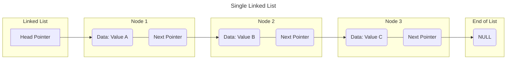

# Single Linked List

```mermaid
---
title : Single Linked List
---
graph LR
    subgraph List_Start [Linked List]
        head_ptr["Head Pointer"]
    end

    subgraph Node_1 [Node 1]
        node1_data("Data: Value A")
        node1_next("Next Pointer")
        node1_data --- node1_next
    end

    subgraph Node_2 [Node 2]
        node2_data("Data: Value B")
        node2_next("Next Pointer")
        node2_data --- node2_next
    end

    subgraph Node_3 [Node 3]
        node3_data("Data: Value C")
        node3_next("Next Pointer")
        node3_data --- node3_next
    end

    subgraph List_End [End of List]
        null_ptr("NULL")
    end

    head_ptr --> node1_data
    node1_next --> node2_data
    node2_next --> node3_data
    node3_next --> null_ptr
```
